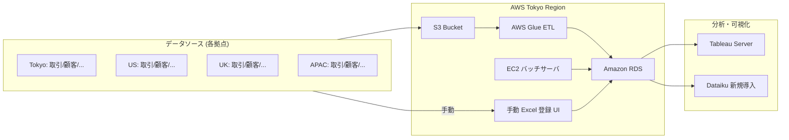
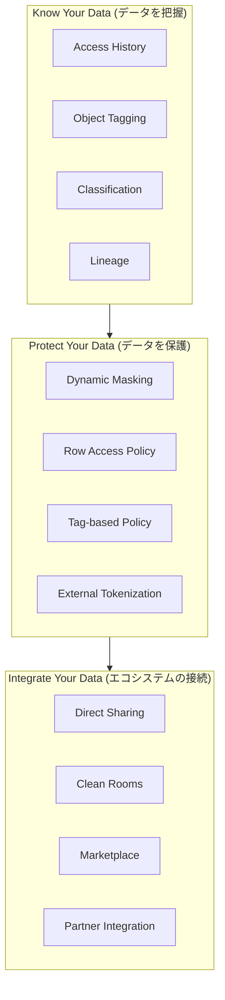

# アーキテクチャ: As-Is と To-Be

## 1. 銀行業務における 4 つのデータ登録パターン (As-Is)

多くの金融機関のデータプラットフォームでは、業務領域ごとに異なるデータ登録フローが共存し、結果的に管理コストとガバナンスリスクが積み上がっています。

| # | パターン | 典型的な構成 | 主な課題 |
|---|---|---|---|
| ① | SQL 処理のみ | システム管理者が SQL で直接データ加工 | 手動オペレーションで、変更履歴・実行ログが残りにくい |
| ② | S3 → Glue ETL | S3 に置かれたファイルを AWS Glue で変換し DB へ格納 | Glue ジョブの維持・コード管理コスト、サーバーレスでも最小コンピュートが大きい |
| ③ | オンプレ/EC2 バッチ | 専用サーバ上で Python/.bat スクリプトを cron 実行 | サーバ維持・パッチ対応・障害対応コスト |
| ④ | ユーザ手動登録 (Excel) | LOB ユーザが Excel ファイルを手動で UI からアップロード | ガバナンスリスク、根拠追跡困難、人手の負担 |

これに加え、**Tableau** などの可視化ツール、**Dataiku** などの分析ツール、**Active Directory** によるアクセス制御が個別に運用され、全体としてのガバナンスを担保するのが難しくなります。

---

## 2. As-Is アーキテクチャ図



### 主な改善余地

1. **アクセス権限の分散管理**: AD / Tableau / RDS / S3 で個別に管理
2. **半構造化データ (XML/JSON) の取り扱い**: Python スクリプトでテーブル化が必要
3. **PII マスキング**: 目視判断 → 工数大・抜け漏れリスク
4. **ロングクエリ性能**: Tableau のカスタム SQL が DB から応答返らない
5. **ガバナンスの一貫性**: Tableau 中心で実装、他ツールへの拡張困難

---

## 3. To-Be アーキテクチャ図

```mermaid
flowchart LR
    subgraph SRC["データソース (各拠点)"]
        T_TKY[Tokyo: 取引/顧客/...]
        T_US[US: 取引/顧客/...]
        T_UK[UK: 取引/顧客/...]
        T_APAC[APAC: 取引/顧客/...]
    end

    subgraph SF["Snowflake (Multi-cluster, Multi-cloud)"]
        STAGE[Internal/External Stage]
        RAW["Raw Layer<br/>(raw_trade / raw_customer / raw_excel)"]
        HARM["Harmonized Layer<br/>(Dynamic Tables)"]
        ANALYTICS["Analytics Layer<br/>(Views)"]
        SEM["Semantic Layer<br/>(Cortex Analyst)"]
        GOV["Governance<br/>(RBAC + Tag-based<br/>Masking + Row Access)"]
        CORTEX["Cortex AI<br/>(LLM Functions /<br/>Search / Analyst)"]
    end

    subgraph CONS["分析・可視化"]
        TAB[Tableau<br/>(既存接続継続)]
        DKU[Dataiku<br/>(Pushdown 連携)]
        SIS[Streamlit in Snowflake]
        SI[Snowflake Intelligence]
    end

    SRC -->|Snowpipe<br/>COPY INTO| STAGE
    STAGE --> RAW
    RAW -->|Dynamic Tables /<br/>Tasks + Streams| HARM
    HARM --> ANALYTICS
    ANALYTICS --> SEM
    GOV -.適用.- RAW
    GOV -.適用.- HARM
    GOV -.適用.- ANALYTICS
    CORTEX --> SEM
    SEM --> TAB
    SEM --> DKU
    SEM --> SIS
    SEM --> SI
```

---

## 4. 4 データフロー課題と Snowflake による解決

| # | 現行課題 | Snowflake による解決策 | 本ハンズオンの該当セクション |
|---|---|---|---|
| ① | SQL 処理のみ (手動運用) | Snowsight で SQL を一元管理。`QUERY_HISTORY` で実行履歴を完全記録 | Section 1 / 4 |
| ② | S3 + Glue ETL (運用コスト) | `Snowpipe` の自動取り込み + `Dynamic Tables` で宣言的変換。Glue 廃止可 | Section 2(a) / 3 |
| ③ | オンプレバッチサーバ (維持コスト) | `Tasks + Streams` または `Dynamic Tables` で Snowflake 内 SQL 完結 | Section 3 |
| ④ | 手動 Excel 登録 (ガバナンスリスク) | Internal Stage + Snowpark Stored Procedure + Task で半自動化。Streamlit でセルフサービス UI 化も可 | Section 2(b) |

---

## 5. ガバナンス強化のフレームワーク



これらは **Section 4 (ガバナンス)** で実装します。

---

## 6. 本ハンズオン後の Next Steps

1. **アーキテクチャ設計レビュー** — 本日確認した To-Be 構成を、貴社固有の業務要件に合わせて詳細設計
2. **PoC 実施** — S3 → Snowpipe → Dynamic Tables の実証 (1〜2 拠点 / 1〜2 業務領域)
3. **Dataiku 連携設計** — Pushdown 環境のセットアップとサービスアカウント設計
4. **ガバナンス設計** — RBAC・タグベースマスキングポリシーの設計書作成
5. **本番移行計画** — オンプレバッチ・Glue の段階的置き換え

---

## 関連資料

- [`docs/agenda.md`](agenda.md) — 詳細タイムテーブル
- [`docs/knowledge_mapping.md`](knowledge_mapping.md) — 必要ナレッジ対応表
- [`docs/dataiku_integration_notes.md`](dataiku_integration_notes.md) — Dataiku Pushdown 設計詳細
- [`docs/excel_demo_appendix.md`](excel_demo_appendix.md) — Excel デモ補足 (Snowpark vs SPCS / Openflow 比較)
