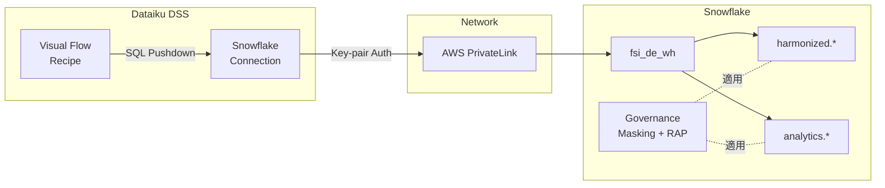

# Dataiku × Snowflake Pushdown 連携 設計ノート

> 本資料はセクション 5 (Cortex AI) の末尾で紹介する **Dataiku Pushdown 連携** の詳細設計資料です。
> ハンズオン本編ではデモは行いませんが、本番導入検討時の参考としてください。

---

## 1. Pushdown 連携とは

Dataiku の「In-Database (Pushdown)」モードでは、データ処理のロジックを **Snowflake 側で実行** します。
Dataiku はオーケストレーション + UI を担当し、実際のデータ移動は最小限に抑えられます。

```
[Dataiku DSS Server]  →  SQL 発行  →  [Snowflake Warehouse]
                     ←  結果返却  ←
```

### メリット

| # | メリット | 詳細 |
|---|---|---|
| 1 | **データ移動なし** | Snowflake 内で完結。EC2 へのデータ転送コスト・レイテンシ解消 |
| 2 | **Snowflake のスケール活用** | 大規模データセットでも WH サイズ調整で対応 |
| 3 | **ガバナンス一元化** | Snowflake の Masking / Row Access が Dataiku 経由でも適用される |
| 4 | **監査ログ統合** | Dataiku 経由の全クエリが `ACCESS_HISTORY` に記録 |

---

## 2. サービスアカウント設計 (`fsi_dataiku_svc`)

### 権限設計 (最小権限原則)

```sql
-- setup.sql で既に作成済み:
CREATE ROLE IF NOT EXISTS fsi_dataiku_svc;
GRANT ROLE fsi_dataiku_svc TO ROLE fsi_admin;

-- 読み取り専用 + 必要最小限のウェアハウス利用
GRANT USAGE ON WAREHOUSE fsi_de_wh TO ROLE fsi_dataiku_svc;
GRANT USAGE ON DATABASE fsi_zts_101 TO ROLE fsi_dataiku_svc;
GRANT USAGE ON ALL SCHEMAS IN DATABASE fsi_zts_101 TO ROLE fsi_dataiku_svc;
GRANT SELECT ON ALL TABLES IN SCHEMA fsi_zts_101.harmonized TO ROLE fsi_dataiku_svc;
GRANT SELECT ON ALL VIEWS IN SCHEMA fsi_zts_101.analytics TO ROLE fsi_dataiku_svc;
GRANT SELECT ON FUTURE TABLES IN SCHEMA fsi_zts_101.harmonized TO ROLE fsi_dataiku_svc;
GRANT SELECT ON FUTURE VIEWS IN SCHEMA fsi_zts_101.analytics TO ROLE fsi_dataiku_svc;
```

### 設計ポイント

| 項目 | 設計 | 理由 |
|---|---|---|
| **書き込み権限** | なし | Dataiku は分析用途のみ。ETL は Snowflake ネイティブ (Snowpipe/DT) で管理 |
| **WH サイズ** | 共有 (`fsi_de_wh`) or 専用 WH | 分離する場合は `fsi_dataiku_wh` を別途作成 |
| **認証** | キーペア認証 推奨 | パスワードレスで安全。定期ローテーション対応 |
| **ネットワーク** | PrivateLink | 次項参照 |

---

## 3. PrivateLink ネットワークポリシー (参考)

```sql
-- PrivateLink 経由のみ許可する Network Policy パターン
-- 注: 実環境の VPC エンドポイント ID に差し替えてください
CREATE NETWORK RULE IF NOT EXISTS governance.dataiku_private_link_rule
  TYPE = 'PRIVATE_HOST_PORT'
  MODE = 'INGRESS'
  VALUE_LIST = ('vpce-0123456789abcdef0');

CREATE NETWORK POLICY IF NOT EXISTS governance.dataiku_network_policy
  ALLOWED_NETWORK_RULE_LIST = ('governance.dataiku_private_link_rule');

-- サービスロールにのみ適用
ALTER USER dataiku_svc_user SET NETWORK_POLICY = 'governance.dataiku_network_policy';
```

---

## 4. 「LLM as a Judge」による PII 一次判定

将来の拡張ユースケースとして、Cortex AI 関数を活用した **PII 自動検出 → マスキング提案** のパターンを示します。

```sql
-- コンセプト: テーブル内のテキストカラムに個人情報が含まれるか LLM に判定させる
SELECT
    column_name,
    sample_value,
    SNOWFLAKE.CORTEX.COMPLETE(
        'mistral-large2',
        'Does the following text contain personally identifiable information (PII)? ' ||
        'Answer only "YES" or "NO" with a brief reason. Text: ' || sample_value
    ) AS pii_assessment
FROM (
    SELECT 'customer_name' AS column_name, customer_name AS sample_value
    FROM fsi_zts_101.raw_customer.customers
    LIMIT 5
);
```

### ワークフロー

1. **一次判定**: Cortex `COMPLETE` で PII 候補カラムを検出
2. **タグ提案**: 結果をもとに `governance.pii_tag` の付与を提案
3. **人間レビュー**: セキュリティチーム / DPO が確認・承認
4. **自動適用**: 承認されたタグを `ALTER TABLE ... SET TAG` で付与 → マスキング自動適用

---

## 5. Dataiku + Snowflake 構成図



---

## 6. 参考資料

- [Dataiku: Snowflake Connection](https://doc.dataiku.com/dss/latest/connecting/sql/snowflake.html)
- [Dataiku: In-Database (SQL) Recipes](https://doc.dataiku.com/dss/latest/recipes/sql.html)
- [Snowflake: Key-pair Authentication](https://docs.snowflake.com/ja/user-guide/key-pair-auth)
- [Snowflake: Network Policies](https://docs.snowflake.com/ja/user-guide/network-policies)
- [Snowflake: PrivateLink](https://docs.snowflake.com/ja/user-guide/admin-security-privatelink)
