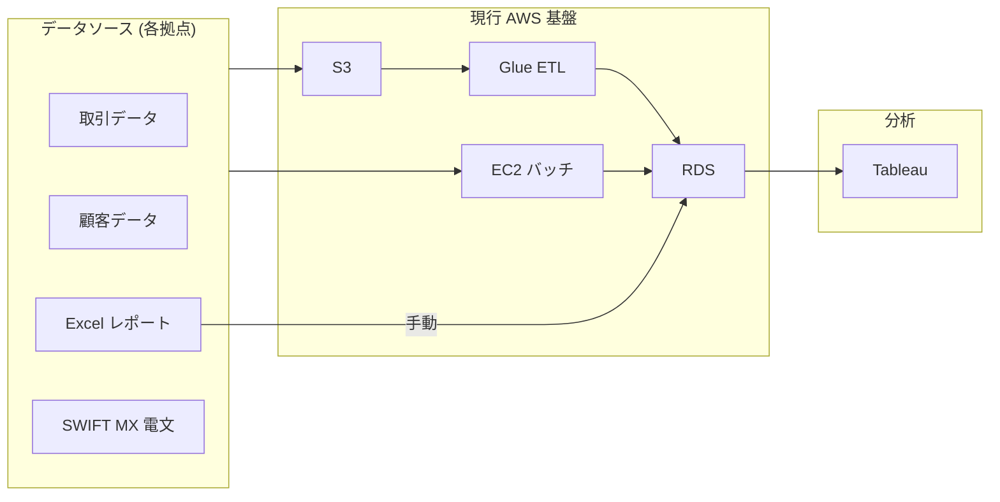
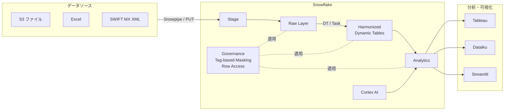

# Section 0: オープニング — Snowflake による提案全体像 (20 分)

> 講師用スクリプト (SQL 実行なし、スライド / 口頭で進行)

---

## 1. ご挨拶 & 本日のゴール (3 分)

- 自己紹介
- **本日のゴール**:
  1. Snowflake AI Data Cloud の基本操作を体験する
  2. 既存の 4 データ登録フロー (SQL only / S3+Glue / オンプレバッチ / 手動 Excel) の課題に対し、Snowflake ネイティブの解決策を理解する
  3. 本番導入に向けた次のアクション (PoC / 設計レビュー) を整理する

---

## 2. Snowflake AI Data Cloud の全体像 (5 分)

### アーキテクチャの 3 層

| 層 | 機能 | ハンズオン対応 |
|---|---|---|
| **Cloud Services** | メタデータ / 認証 / オプティマイザ / RBAC | Section 1 (Getting Started) |
| **Compute** | Virtual Warehouse (独立スケール / 自動サスペンド) | Section 1 |
| **Storage** | マイクロパーティション / ゼロコピークローン / Time Travel | Section 1 |

### 主要な差別化ポイント (FSI 向け)

- **マルチクラスタ共有データ**: 同じデータに対して複数 WH が同時アクセス (Tableau + Dataiku + バッチ)
- **ガバナンス一元化**: Tag-based Masking / Row Access → Tableau でも Streamlit でも同一ポリシー適用
- **AI ネイティブ**: Cortex AI 関数で SQL から直接 LLM 推論 (データ移動なし)
- **データ残留性**: `CORTEX_ENABLED_CROSS_REGION = 'AWS_JP'` で東京/大阪に推論を限定

---

## 3. 銀行業務における 4 つのデータ登録パターンと課題 (7 分)

### As-Is アーキテクチャ

### 4 パターンの課題と Snowflake 解決策

| # | 現行パターン | 課題 | Snowflake 解決策 | 今日のセクション |
|---|---|---|---|---|
| ① | SQL 処理のみ | 手動運用、履歴なし | Snowsight + Query History | **1** |
| ② | S3 → Glue ETL | Glue 維持コスト、小ファイル非効率 | **Snowpipe** / COPY INTO | **2(a)** |
| ③ | EC2 バッチ処理 | サーバ維持・障害対応 | **Dynamic Tables** / Tasks | **3** |
| ④ | 手動 Excel 登録 | ガバナンスリスク、根拠追跡困難 | **Snowpark SP + Task** | **2(b)** |

### To-Be アーキテクチャ

---

## 4. 本日のハンズオン構成 (3 分)

| 時間 | セクション | 内容 |
|---|---|---|
| 14:00-14:20 | **0. オープニング (今ここ)** | 全体像 |
| 14:20-15:05 | **1. Getting Started** | UI / WH / RBAC / Time Travel |
| 15:05-15:35 | **2. データロード** | (a) S3/XML取込 (b) Excel取込 |
| 15:35-15:50 | ☕ **休憩** | — |
| 15:50-16:40 | **3. データ変換** | Dynamic Tables / Tasks+Streams |
| 16:40-17:20 | **4. ガバナンス** | Masking / Row Access / Audit |
| 17:20-17:50 | **5. Cortex AI** | AI 関数 / Search / Dataiku 紹介 |
| 17:50-18:00 | **6. まとめ** | Next Steps |

---

## 5. 環境確認 (2 分)

- 全員 Snowsight にログインできているか確認
- ロール: `ACCOUNTADMIN` が選択されているか
- `setup.sql` が正常完了しているか: 左メニューで `fsi_zts_101` データベースが表示されるか
- 質問があればここで受付

---

> 「それでは Section 1: Getting Started に進みましょう。  
> SQL ファイル `01_getting_started.sql` を Workspaces で開いてください。」
