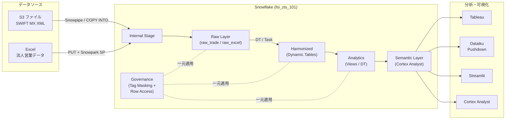

# Section 6: まとめ & Next Steps (10 分)

> 講師用スクリプト (SQL 実行なし、スライド / 口頭で進行)

---

## 1. 本日のハンズオンで体験したこと

| セクション | 学んだこと | 対応する現行課題 |
|---|---|---|
| **1. Getting Started** | WH スケーリング / RBAC / Time Travel / Resource Monitor | インフラ管理・コスト管理 |
| **2. データロード** | COPY INTO (CSV/JSON/XML) / Snowpipe / Snowpark SP + Task | S3+Glue 代替 / 手動 Excel 代替 |
| **3. データ変換** | Dynamic Tables / Tasks+Streams / DAG 可視化 | EC2 バッチサーバ代替 |
| **4. ガバナンス** | タグベースマスキング / Row Access / Access History | 分散ガバナンスの一元化 |
| **5. Cortex AI** | AI 関数 (分類/センチメント) / Search / Analyst / Dataiku 連携 | AI 活用の将来像 |

---

## 2. To-Be アーキテクチャの再確認

---

## 3. 4 データフロー課題の解決状況

| # | 課題 | Snowflake による解決 | 状態 |
|---|---|---|---|
| ① | SQL 処理のみ (手動運用) | Snowsight + Query History で実行履歴を完全記録 | ✅ 本日体験 |
| ② | S3 + Glue ETL (運用コスト) | Snowpipe 自動取込み + Dynamic Tables で宣言的変換 | ✅ 本日体験 |
| ③ | EC2 バッチサーバ (維持コスト) | Tasks + Streams / Dynamic Tables で Snowflake 内完結 | ✅ 本日体験 |
| ④ | 手動 Excel 登録 (ガバナンスリスク) | Snowpark SP + Task で半自動化。Streamlit でセルフサービス UI 化も可 | ✅ 本日体験 |

---

## 4. 必要ナレッジ対応表 (★ 優先度)

> 詳細は [`docs/knowledge_mapping.md`](../docs/knowledge_mapping.md) を参照

| 現行コンポーネント | Snowflake 対応技術 | 優先度 |
|---|---|---|
| S3 + Glue (ETL) | Stage / COPY INTO / Snowpipe | ★★★ |
| 半構造化データ (XML/JSON) | VARIANT / XMLGET / FLATTEN | ★★★ |
| 手動 Excel | Snowpark SP + Task | ★★★ |
| EC2 バッチ処理 | Tasks + Streams / Dynamic Tables | ★★★ |
| アクセス管理 (AD/IAM) | RBAC (Role Hierarchy) | ★★★ |
| データ保護 (PII) | タグベースマスキング / Row Access | ★★★ |
| Dataiku 連携 | Snowpark Pushdown / Service Account | ★★★ |
| 監査・ログ | Access History / Query History | ★★ |
| データ分類 (PII 自動検出) | Classification / Trust Center | ★★ |
| AI / LLM | Cortex AI 関数 / Search / Analyst | ★★ |
| コスト管理 | Resource Monitor / Budget | ★★ |
| ネットワークセキュリティ | Network Policy / PrivateLink | ★★ |

---

## 5. Next Steps (ご提案)

| # | アクション | 内容 | 推奨時期 |
|---|---|---|---|
| ① | **アーキテクチャ設計レビュー** | 本日確認した To-Be 構成を、貴社固有の業務要件に合わせて詳細設計 | 1-2 週間以内 |
| ② | **PoC 実施** | S3 → Snowpipe → Dynamic Tables の実証 (1-2 拠点 / 1-2 業務領域) | 設計レビュー後 |
| ③ | **Dataiku 連携設計** | Pushdown 環境のセットアップとサービスアカウント設計 | PoC と並行 |
| ④ | **ガバナンス設計** | RBAC / タグベースマスキングポリシーの設計書作成 | PoC と並行 |
| ⑤ | **本番移行計画** | EC2 バッチ / Glue ETL の段階的置き換えスケジュール策定 | PoC 完了後 |

---

## 6. クリーンアップ

- 本日のハンズオン環境は 30 日間有効です
- トライアルを継続利用する場合は [`cleanup.sql`](../cleanup.sql) でリソースを削除可能
- 詳細: [`docs/cleanup_guide.md`](../docs/cleanup_guide.md)

---

## 7. Q&A

> ご質問をお受けします。

---

## 8. クロージング

- 本日のアセット: **GitHub リポジトリ** (URL は別途共有)
- フォローアップ連絡先: (講師から案内)
- アンケート: (任意)

---

> ご参加ありがとうございました。
